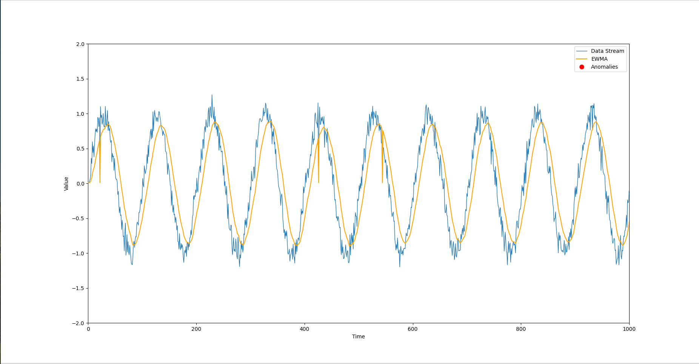

# Real-Time Data Stream Anomaly Detection with EWMA

This project implements a real-time data stream simulator and an Exponentially Weighted Moving Average (EWMA) anomaly detection system, visualized using `matplotlib`. The system simulates a data stream, applies EWMA to detect anomalies in real-time, and dynamically plots the data, the EWMA, and any anomalies detected.

## Table of Contents

- [Project Overview](#project-overview)
- [Features](#features)
- [Directory Structure](#directory-structure)
- [Installation](#installation)
- [Usage](#usage)
- [Algorithm Explanation](#algorithm-explanation)
- [Error Handling](#error-handling)
- [License](#license)

## Project Overview

This project is a simulation-based application that:
1. **Simulates a data stream** with a seasonal pattern (sine wave) and random noise.
2. **Applies EWMA** (Exponentially Weighted Moving Average) to the data stream for anomaly detection.
3. **Visualizes the data**, EWMA line, and anomalies in real time.

EWMA is particularly useful in detecting subtle changes in the data pattern, making it ideal for anomaly detection in time-series data.

## Screenshot of Result


## Features

- Real-time data stream generation with added noise.
- EWMA-based anomaly detection.
- Dynamic visualization of the data stream, EWMA, and detected anomalies.
- Modular structure for easy maintainability and extension.
  
## Directory Structure

```
Efficient-Data-Stream-Anomaly-Detection/
│
├── main.py                 # Entry point of the application
├── requirements.txt        # List of dependencies
├── README.md               # Project description and instructions
│
├── detector/
│   └── ewma_detector.py    # EWMAAnomalyDetector class
│
├── simulator/
│   └── data_stream.py      # DataStreamSimulator class
│
└── plotter/
    └── real_time_plotter.py # RealTimePlotter class
```

## Installation

1. **Clone the repository**:

   ```bash
   git clone https://github.com/rkaran2558/Efficient-Data-Stream-Anomaly-Detection.git
   cd Efficient-Data-Stream-Anomaly-Detection
   ```
2. **Install required system dependencies only for Linux Systems**:

   This project requires `python3-tk` for the visualization. Install it using:

   ```bash
   sudo apt-get install python3-tk
   ```
3. **Install required Python dependencies**:

   Make sure you have Python 3.x installed. Then install the dependencies listed in `requirements.txt`:

   ```bash
   pip install -r requirements.txt
   ```

   Example of `requirements.txt`:

   ```
   matplotlib==3.4.3
   numpy==1.21.2
   ```


3. **Run the project**:

   Execute the main Python script to start the simulation and real-time visualization:

   ```bash
   python main.py
   ```

## Usage

- The application will simulate a real-time data stream and plot the data points in real-time.
- The EWMA algorithm is applied to detect anomalies in the data stream.
- The plot will show:
  - **Data Stream**: The noisy sine wave.
  - **EWMA**: A smoothed version of the data stream.
  - **Anomalies**: Points where the deviation from the EWMA exceeds the specified threshold.
  
## Algorithm Explanation

### Exponentially Weighted Moving Average (EWMA)
EWMA is a time-series smoothing technique that gives more weight to recent data points. It's defined as:

\
	EWMA_t = α×X_t + (1−α)×EWMA_t−1

Where:
- \(X_t) is the current data point.
- \(α) is the smoothing factor (0 < (α) ≤ 1).
  
The anomaly detection is based on comparing the current data point with the calculated EWMA. If the difference (anomaly score) between them exceeds a pre-defined threshold, the point is flagged as an anomaly.

### Why EWMA?
EWMA is effective at detecting sudden or gradual changes in time-series data because it assigns exponentially decreasing weights to older data points. It's particularly useful when you want to identify outliers or anomalies without excessive false positives.

### Visualization
Using `matplotlib`, the data stream, EWMA line, and anomaly points are plotted in real-time to give a visual representation of the data and anomalies as they occur.

## Error Handling

- **Data Stream**: The code ensures a continuous flow of data even with artificial delays between points to simulate real-time data acquisition.
- **Anomalies**: The anomaly detection system gracefully handles edge cases, such as initialization with the first data point.
- **Interruptions**: The code catches `KeyboardInterrupt` to allow for graceful termination of the program.

## License

This project is licensed under the MIT License - see the [LICENSE](LICENSE) file for details.
